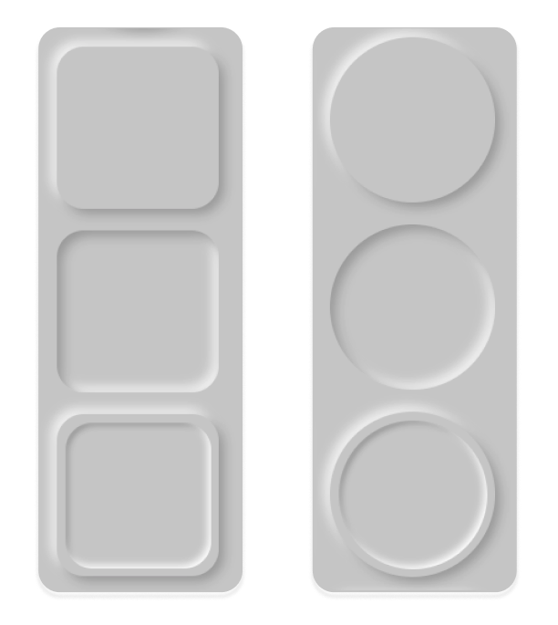

# Nuemorphism / Soft UI - Vue generic element

## Project archived!

> Neumorphism / Soft UI easy to customize generic component.



## Install
```shell
$ npm i vue-neumorphism-element --save
```

### Basic Usage
```vue
<template>
  <div class="app">
    <NeuElement
      tag="div"
      :classList="['class1', 'class2']"
      type="flat"
      :surrounded="false"
      height="150px"
      width="150px"
      radius="50%"
      color="#d2d2d2"
      :distance="5"
      :intensity="0.15"
      :blur="10"
    >
    Insert HTML code here if you need
    </NeuElement>
  </div>
</template>

<script>
import NeuElement from "vue-neumorphism-element";

export default {
  components: { NeuElement }
}
</script>

<style>
@import '~vue-neumorphism-element/dist/vue-neumorphism-element.css';
</style>
```

## Props

| Property | Description | Type | Accepted Values | Default |
|-|-|-|-|-|
| tag | HTML element tag | String | All valid HTML elements | div |
| classList | Array of class names | Array | - | - |
| width | Element width | String | - | - |
| height | Element height | String | - | - |
| surrounded | Add additional surrounded type | Boolean | - | false |
| surroundWidth | Surrounded border width | String | - | - |
| surroundHeight | Surrounded border height | String | - | - |
| color | Element color *required | String | - | - |
| radius | Element border radius | String | - | 50px |
| distance | Neumorphism style distance | String | - | 30 |
| intensity | Neumorphism style intensity | Number | - | 0.15 |
| blur | Neumorphism style blur | Number | - | 60 |
| type | Element type | String | flat, concave, convex, pressed | flat |


## License

MIT © Marceli Olszewski - 2020
